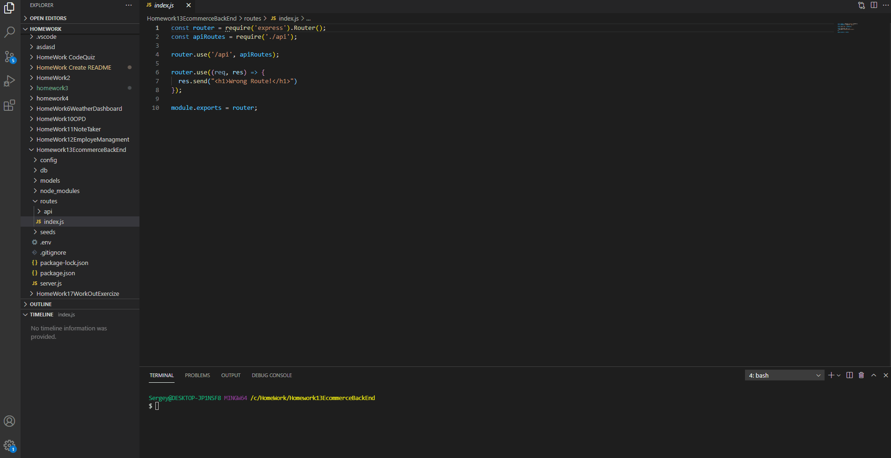

   <h1>Title Name: Object-Relational Mapping (ORM): E-Commerce Back End </h1>
  
   

## Description :

Internet retail, also known as **e-commerce**, is the largest sector of the electronics industry, generating an estimated $29 trillion in 2019. E-commerce platforms like Shopify and WooCommerce provide a suite of services to businesses of all sizes. Due to their prevalence, understanding the fundamental architecture of these platforms will benefit you as a full-stack web developer.Your task is to build the back end for an e-commerce site . You’ll configure a working Express.js API to use Sequelize to interact with a MySQL database.

   <h3>## Content :

- [Description](#description)
- [Instruction](#instructions)
- [Usage](#usage)
- [Contributers](#contributers)
- [GitHub](#GitHub)
- [Email](#mail)
</h3>

## Instruction :

node index.js , insomnia

## Usage :

node.js, express.js, insomnia, mysql

## Contributers : Sergey Ishimov

## GitHub : (https://github.com/Sergey-ddbug)

## Email : sishimov@gmail.com

